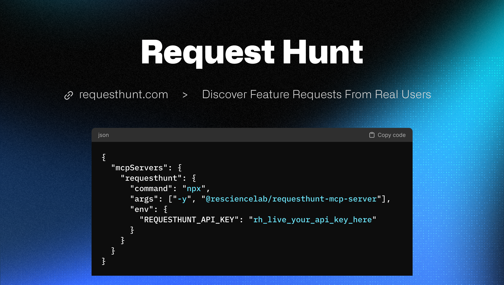

# 👋 Hi there, I'm Yilin Jing! 

## 🧠 About Me

I'm passionate about software development, data engineering, and ethical computing. Currently focused on building full-stack toolchains for OPC (One Person Company).

---

## RequestHunt

  

---

## E2M - Everything to Markdown

  

  
<strong>Document Conversion Reimagined</strong> - 1000+ ⭐️

  
Transform any file format to Markdown

  

    
    
  

---

## 🛠️ Tech Stack

### Core Technologies

### Software Development Ecosystem

---

## 📈 Activity Map

  

---

## 🎓 Academic Background

🎓 **MSc in Applied Computational Science and Engineering**  
Imperial College London
> Research: Computational Methods & Algorithms

🎓 **First-Class Honours in Communications Engineering**  
University of Sussex
> Focus: Signal Processing & Software Development

---

  ☕ Buy me a coffee if you like my work!
   
  

